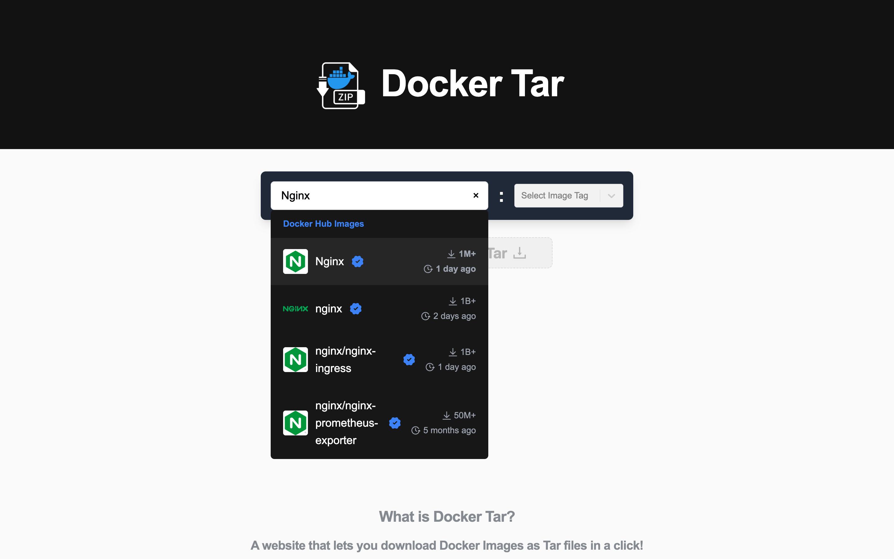
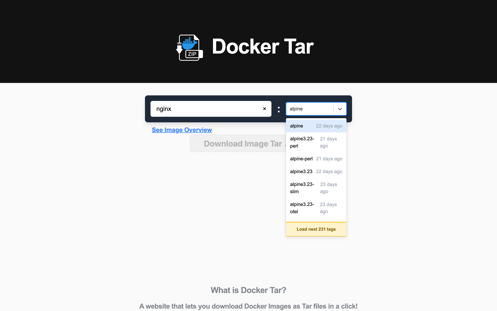
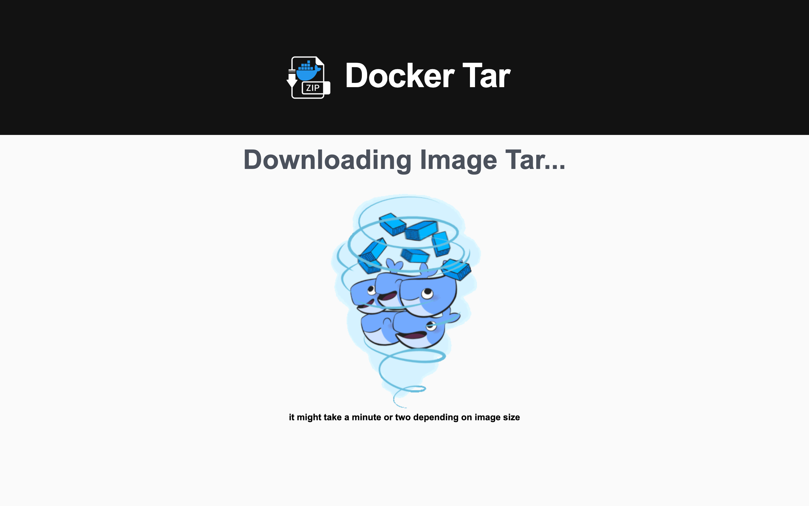
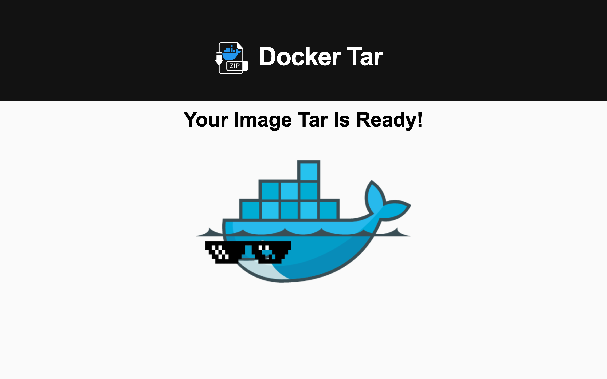

x<div align="center">
  
  
  # Docker Tar
  
  **Download Docker Images as Tar Files - No Docker Required**
  
  [](https://dockertar.zapto.org)
  [](#license)
  [](https://python.org)
  [](https://reactjs.org)
  
</div>

---

## 🚀 What is Docker Tar?

Docker Tar solves a fundamental problem: **downloading Docker images without having Docker installed**. Whether you're on a restricted network, working on a machine without Docker, or need to distribute images offline, Docker Tar provides a simple web interface to download any public Docker image as a tar file.

### ✨ Key Features

- 🔍 **Smart Search** - Search through millions of Docker Hub images with intelligent autocomplete
- 🏷️ **Complete Tag Support** - Browse and select from all available image tags
- ⚡ **Instant Downloads** - Download and stream images directly to your browser as tar files
- 🎯 **No Installation Required** - Works entirely through your web browser
- 🔒 **Secure & Clean** - Images are automatically cleaned up after download
- 📱 **Responsive Design** - Works seamlessly on desktop and mobile devices


## 🖥️ Screenshots

<div align="center">

### Smart Image Search
*Search millions of Docker Hub images with autocomplete — logos, verified/official badges, pull counts and last-updated times*



### Tag Selection
*Browse every tag for an image, with fast filtering and incremental loading of large tag lists*



### Download in Progress
*Real-time feedback while the image is pulled and streamed to your browser as a tar*



### Success State
*Your tar file is ready for use*



</div>

## 🏗️ Architecture

Docker Tar is built with modern web technologies for optimal performance and reliability:

### Frontend
- **React 18** - Modern, responsive user interface
- **Turnstone** - Intelligent search with autocomplete
- **Tailwind CSS** - Clean, professional styling
- **Ant Design** - Polished UI components

### Backend
- **FastAPI** - High-performance Python web framework
- **Docker SDK** - Direct integration with Docker engine

### Infrastructure
- **Nginx** - Reverse proxy for the the DockerHub API (Crucial for bypassing CORS), and also for the backend and frontend.
  
## 🚀 Quick Start

### Prerequisites
- Python 3.8+
- Node.js 16+
- Docker Engine
- Nginx (for production)

### One-Click Local Run (macOS)

The fastest way to run the whole stack (backend + frontend + nginx) locally:

1. Make sure **Docker Desktop** is installed and **Homebrew** is available.
2. Double-click **`run-local.command`** in Finder (or run `./run-local.command`).

It automatically:
- installs nginx via Homebrew on first run (if missing),
- creates a Python venv and installs backend dependencies,
- installs frontend dependencies (if needed),
- writes `front-end/.env.local` pointing the app at the local nginx,
- starts the backend (`:8080`), frontend (`:3000`) and nginx (`:8081`),
- opens the app at **http://localhost:8081**.

Press `Ctrl+C` in the window, or double-click **`stop-local.command`**, to stop
everything. Logs and generated files live in `.local-run/` (gitignored). nginx
runs on port `8081` (not `80`) so no `sudo`/password is ever required; change
`NGINX_PORT` at the top of `run-local.command` if that port is taken.

### Development Setup (manual)

1. **Clone the repository**
   ```bash
   git clone https://github.com/yourusername/docker-tar.git
   cd docker-tar
   ```

2. **Start the backend**
   ```bash
   cd back-end
   pip install -r requirements.txt
   python app.py
   ```
   * you might need to start it within wsl, if running docker desktop on windows with wsl.

3. **Start the frontend**
   ```bash
   cd front-end
   npm install
   npm start
   ```

   **Configuring URLs (run locally):** All external URLs live in
   `front-end/src/config.js` and are driven by environment variables. To point
   the app at a local backend instead of production, copy the template and edit
   it:
   ```bash
   cp .env.example .env.local
   # then set, e.g.:
   #   REACT_APP_BACKEND_URL=http://localhost:8080
   #   REACT_APP_DOCKERHUB_PROXY_URL=http://localhost:8080
   ```
   Restart `npm start` after changing env values. Unset values fall back to the
   production host (`https://dockertar.zapto.org`).

4. **Open your browser**
   ```
   http://localhost:3000
   ```

### Production Deployment

For production deployment, configure Nginx as a reverse proxy to the backend, Dockerhub API and frontend services.

## 📡 API Reference

### Download Image Tar

```http
GET /install/image-tar?image_name={name}&image_tag={tag}
```

**Parameters:**
- `image_name` (required) - Docker image name (e.g., `nginx`, `ubuntu`)
- `image_tag` (required) - Image tag (may be empty)

**Response:**
- Content-Type: `application/x-tar`
- Content-Disposition: `attachment; filename="{image_name}.tar"`
- Body: Streaming tar file data

**Example:**
```bash
curl -O "https://dockertar.zapto.org/install?image_name=nginx&image_tag=alpine"
```

## 🛠️ Development

### Project Structure
```
docker-tar/
├── back-end/          # FastAPI server
│   ├── app.py         # Main application
│   └── requirements.txt
├── front-end/         # React application  
│   ├── src/
│   │   ├── App.js     # Main component
│   │   └── components/
│   └── package.json
└── CLAUDE.md          # Technical documentation
```

### Available Scripts

**Frontend:**
```bash
npm start          # Development server
npm run build      # Production build
npm run build:css  # Build Tailwind CSS
```

**Backend:**
```bash
python app.py      # Start FastAPI server
```

## 🤝 Contributing

We welcome contributions! Here's how you can help:

1. **Fork the repository**
2. **Create a feature branch** (`git checkout -b feature/amazing-feature`)
3. **Commit your changes** (`git commit -m 'Add amazing feature'`)
4. **Push to the branch** (`git push origin feature/amazing-feature`)
5. **Open a Pull Request**

### Development Guidelines
- Follow existing code style and conventions
- Add tests for new features
- Update documentation as needed
- Ensure all tests pass before submitting

## 📝 License

This project is licensed under the MIT License - see the [LICENSE](LICENSE) file for details.


## 📞 Support

- **Live Production Website**: [dockertar.zapto.org](https://dockertar.zapto.org)
- **Issues**: [GitHub Issues](https://github.com/yourusername/docker-tar/issues)
- **Feedback**: [Google Form](https://forms.gle/Mr3vmAk5Fz81VRKh6)

---

<div align="center">
  
**Made with ❤️ for the Docker community**

[⭐ Star this repo](https://github.com/yourusername/docker-tar) if you find it useful!

</div>
